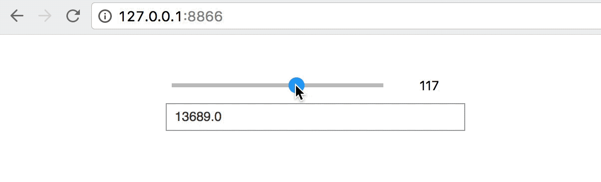

Jupyter widgets server
======================

[](http://ipywidgets-server.readthedocs.io/en/latest/?badge=latest)

Ever wanted to display Jupyter widgets outside of a notebook environment?
This lets you do it.

For more information, view the [docs page](http://ipywidgets-server.readthedocs.io/en/stable/).

**Warnings**

You probably should not use this in production yet.

This only supports Python 3.6 at present (PRs welcome)!

## Installation

You should install *ipywidgets_server* with `pip`:

```
$ pip install ipywidgets_server
```

To install from source, clone this repository and run:

```
$ cd ipywidgets_server/
$ pip install -e .
```

## Usage

Create a python file (not a notebook) that renders your favourite widget. Let's, for
instance, create a file called `example.py` that contains:

```py
# example.py

from ipywidgets import IntSlider, Text, VBox
s = IntSlider(max=200, value=100)
t = Text()

def update_text(change=None):
    t.value = str(float(s.value) ** 2)

s.observe(update_text, names='value')
update_text()
vbox = VBox([s, t])
```

To serve the widget, go to the directory containing `example.py` and run:

```
$ ipywidgets-server example:vbox
```

This will serve the widget on `http://localhost:8866`:



The command line argument is `<module name>:<object name>`, where `<module
name>` is the name of a Python module that can be imported, and `<object
name>` is the name of the variable that holds the widget to display.

For information on other command line arguments, run:

```
$ ipywidgets-server --help
```

## Credit where it's due

Much of the frontend code for this is inspired by the *web3* example in
[ipywidgets](https://github.com/jupyter-widgets/ipywidgets/tree/master/examples).

The original idea of writing a custom kernel to stop arbitrary code execution
on the server came from [Maarten
Breddels](https://twitter.com/maartenbreddels).

Most of the implementation is inspired by various parts of ipywidgets and Jupyter.
