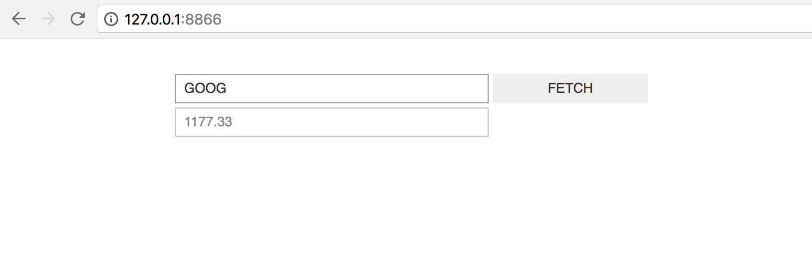

Tutorials
=========

Simple widget
-------------

Let's build a stock price fetcher. We will allow the user to enter a stock
ticker symbol and fetch information about the current stock price from the
`Quandl API <https://www.quandl.com/>`_. The code for this example is also available in
`examples/stock_price <https://github.com/pbugnion/ipywidgets_server/tree/master/examples/stock_price>`_.

::

    # example.py

    from urllib.request import urlopen
    from urllib.error import HTTPError

    import json
    
    import ipywidgets as widgets

    BASE_URL = 'https://www.quandl.com/api/v3/datasets/WIKI/{}.json?rows=1'

    stock_input = widgets.Text('GOOG')
    fetch_button = widgets.Button(description='FETCH')
    result_container = widgets.HBox([
        widgets.Text(disabled=True)
    ])

    def get_stock_price(symbol):
        """ Fetch stock price for `symbol` from quandl API """
        with urlopen(BASE_URL.format(symbol)) as response:
            response_json = json.loads(response.read())
        return response_json['dataset']['data'][0][1]

    def handle_fetch_error(error, symbol):
        if error.code == 404:
            message = 'Stock symbol {} not found'.format(symbol)
        else:
            message = 'Unexpected error'
        result_container.children = [widgets.Label(message)]

    def on_button_click(arg):
        """ Callback when 'fetch' button is clicked """
        # Disable widgets to give feedback that something is happening
        stock_input.disabled = True
        fetch_button.disabled = True

        # Fetch the stock price
        symbol = stock_input.value.upper()
        try:
            stock_price = get_stock_price(symbol)
            result_container.children = [
                widgets.Text(str(stock_price), disabled=True)
            ]
        except HTTPError as error:
            handle_fetch_error(error, symbol)

        # Re-enable the widgets
        stock_input.disabled = False
        fetch_button.disabled = False

    fetch_button.on_click(on_button_click)

    container = widgets.VBox([
        widgets.HBox([stock_input, fetch_button]),
        result_container
    ])

To run the example, enter this shell command::

    $ ipywidgets-server example:container

This will serve this example on the default port, 8866. Visit
``http://127.0.0.1:8866`` with your browser, and you should see the widget.

We note the following:

- we wrap all the widgets into a top-level container, ``container``. This is the
  widget we then ask ``ipywidgets-server`` to display.
- when the user presses the ``FETCH`` button, they should receive some feedback
  that the application is processing their request. Disabling the user inputs
  is an easy way to provide this feedback.
- depending on whether the stock price fetch was successful, we either display
  a text widget with the stock price, or a label widget with an error message.
  To render different widgets conditionally, we anchor a container (an ``HBox``)
  and swap the container's children.

