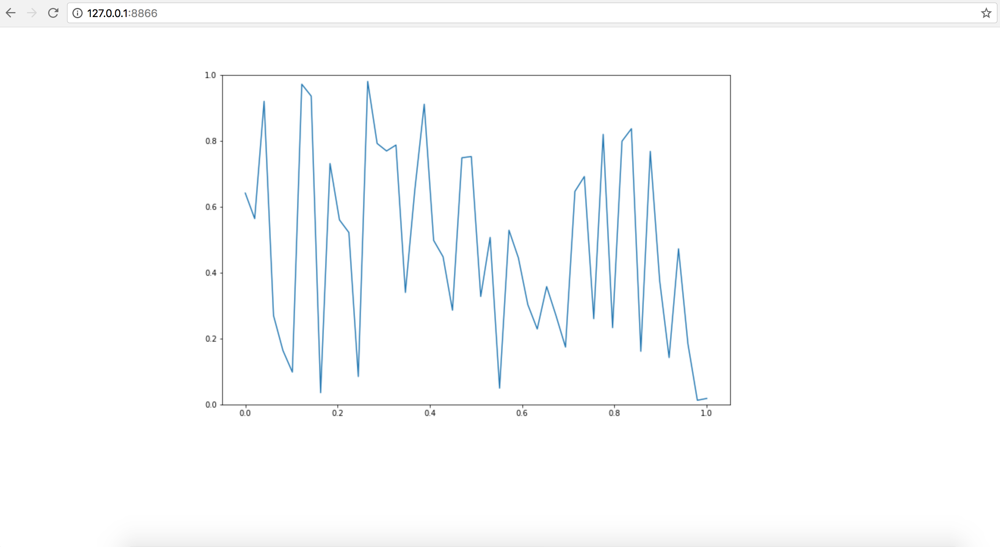

Tutorials
=========

Simple widget
-------------

Let's build a stock price fetcher. We will allow the user to enter a stock
ticker symbol and fetch information about the current stock price from the
`Quandl API <https://www.quandl.com/>`_. The code for this example is also available in
`examples/stock_price <https://github.com/pbugnion/ipywidgets_server/tree/master/examples/stock_price>`_.

.. image:: images/stock-price.png

::

    # example.py

    from urllib.request import urlopen
    from urllib.error import HTTPError

    import json
    
    import ipywidgets as widgets

    BASE_URL = 'https://www.quandl.com/api/v3/datasets/WIKI/{}.json?rows=1'

    stock_input = widgets.Text('GOOG')
    fetch_button = widgets.Button(description='FETCH')
    result_container = widgets.HBox([
        widgets.Text(disabled=True)
    ])

    def get_stock_price(symbol):
        """ Fetch stock price for `symbol` from quandl API """
        with urlopen(BASE_URL.format(symbol)) as response:
            response_json = json.loads(response.read())
        return response_json['dataset']['data'][0][1]

    def handle_fetch_error(error, symbol):
        if error.code == 404:
            message = 'Stock symbol {} not found'.format(symbol)
        else:
            message = 'Unexpected error'
        result_container.children = [widgets.Label(message)]

    def on_button_click(arg):
        """ Callback when 'fetch' button is clicked """
        # Disable widgets to give feedback that something is happening
        stock_input.disabled = True
        fetch_button.disabled = True

        # Fetch the stock price
        symbol = stock_input.value.upper()
        try:
            stock_price = get_stock_price(symbol)
            result_container.children = [
                widgets.Text(str(stock_price), disabled=True)
            ]
        except HTTPError as error:
            handle_fetch_error(error, symbol)

        # Re-enable the widgets
        stock_input.disabled = False
        fetch_button.disabled = False

    fetch_button.on_click(on_button_click)

    container = widgets.VBox([
        widgets.HBox([stock_input, fetch_button]),
        result_container
    ])

To run the example, enter this shell command::

    $ ipywidgets-server example:container

This will serve this example on the default port, 8866. Visit
``http://127.0.0.1:8866`` with your browser, and you should see the widget.

We note the following:

- we wrap all the widgets into a top-level container, ``container``. This is the
  widget we then ask ``ipywidgets-server`` to display.
- when the user presses the ``FETCH`` button, they should receive some feedback
  that the application is processing their request. Disabling the user inputs
  is an easy way to provide this feedback.
- depending on whether the stock price fetch was successful, we either display
  a text widget with the stock price, or a label widget with an error message.
  To render different widgets conditionally, we anchor a container (an ``HBox``)
  and swap the container's children.

Using IPywidget server with Matplotlib
--------------------------------------

Let's build a simple application that updates a matplotlib plot every second. We
use an ``Output`` widget to get capture the matplotlib plot. We then embed our
output widget in a top-level container. Every second, we generate a new output
widget containing a new plot and swap it into the container. The code for this
example is in `examples/matplotlib_random
<https://github.com/pbugnion/ipywidgets_server/tree/master/examples/matplotlib_random>`_::

    # example.py

    import time

    import matplotlib.pyplot as plt

    import numpy as np

    import ipywidgets as widgets
    from IPython.display import display

    SIZE = 50
    XBASIS = np.linspace(0.0, 1.0, SIZE)

    container = widgets.VBox()

    def update():
        """ Generate a new random plot and embed it into the container """
        output = widgets.Output()
        with output:
            fig, ax = plt.subplots(figsize=(12, 8))
            ax.plot(XBASIS, np.random.rand(SIZE))
            ax.set_ylim(0.0, 1.0)
            plt.show()
        container.children = [output]

    display(container)

    while True:
        # Update the plot in a busy loop
        time.sleep(1)
        update()

Save this script to a file called `example.py`. You can then run::

    $ ipywidgets-server example:container

Head over to ``http://127.0.0.1:8866`` in your browser. You should see the widget.

For a more complex example, let's build a widget to explore how the `sin`
changes depending on the parameters that are passed. We will plot ``a *
sin(k*x)``, with sliders to change the value of ``a`` and ``k``. The code for
this example is also available at `examples/matplotlib_sine_waves
<https://github.com/pbugnion/ipywidgets_server/tree/master/examples/matplotlib_sine_waves>`_::

    # example.py

    import matplotlib.pyplot as plt

    import numpy as np

    import ipywidgets as widgets

    XBASIS = np.linspace(-2*np.pi, 2*np.pi)

    class SineRenderer(object):

        def __init__(self):
            self._amplitude_slider = widgets.FloatSlider(
                1.0, min=-2.0, max=2.0, description='amplitude'
            )
            self._frequency_slider = widgets.FloatSlider(
                1.0, min=0.1, max=3.0, description='frequency'
            )
            self._bind_callbacks()
            self._controls_container = widgets.VBox([
                self._amplitude_slider,
                self._frequency_slider
            ])
            self._plot_container = widgets.HBox([])
            self._application_container = widgets.HBox([
                self._controls_container, self._plot_container
            ])

        def _bind_callbacks(self):
            self._amplitude_slider.observe(
                self._on_param_change, names='value')
            self._frequency_slider.observe(
                self._on_param_change, names='value')

        def _on_param_change(self, change):
            self.render()

        def render(self, change=None):
            amplitude = self._amplitude_slider.value
            frequency = self._frequency_slider.value
            output = widgets.Output()
            with output:
                fig, ax = plt.subplots(figsize=(12, 8))
                ax.plot(XBASIS, amplitude * np.sin(frequency*XBASIS))
                ax.set_ylim(-2.5, 2.5)
                plt.show()
            self._plot_container.children = [output]
            return self._application_container

    container = SineRenderer().render()

Save this script to a file called `example.py`. You can then run::

    $ ipywidgets-server example:container

.. image:: images/matplotlib-sine.png

It is worth noting the following:

 - we wrap the application into a controller class responsible both for generating the view and for reacting to user actions. Using a class provides better encapsulation and re-use.
 - in the class constructor, we handle rendering the static components of the view. We create two container widgets, one to hold the sliders and one to hold the plot. We stack these two containers in an ``HBox``, the top level widget holding our application.
 - We handle reacting to changes in the sliders by `observing` the ``value`` traitlet of the slider. The ``.observe`` method takes a callback as first argument. The callback that we pass in just re-renders the plot. The second argument to ``.observe`` is a list of attributes of the slider to observe. We only want to react to changes in the slider value (rather than, say, its maximum or minimum).
 - The ``render`` method of our application renders the dynamic components and returns the top level widget.

